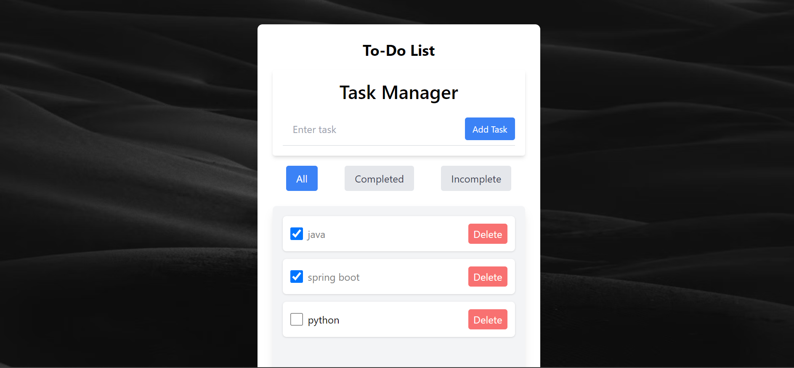

# To-Do List Application

This is a **To-Do List** application built using **React**. It allows users to add, toggle, and delete tasks. The application also includes a filtering feature to view tasks based on their completion status (All, Completed, or Incomplete). The app is styled using **Tailwind CSS** and features a beautiful background image for an enhanced user experience.

---

## Features

- **Add Tasks**: Users can add new tasks to the list.
- **Toggle Task Completion**: Users can mark tasks as completed or incomplete.
- **Delete Tasks**: Users can delete tasks from the list.
- **Filter Tasks**: Users can filter tasks to view:
  - All tasks
  - Completed tasks
  - Incomplete tasks
- **Responsive Design**: The application is fully responsive and works on all screen sizes.

---

## Technologies Used

- **React**: A JavaScript library for building user interfaces.
- **Tailwind CSS**: A utility-first CSS framework for styling the application.
- **React Hooks**: `useState` for managing state within the application.

---

## Project Structure

The project consists of the following components:

1. **`App.jsx`**:
   - The main component that manages the state of tasks and filters.
   - Contains the logic for adding, toggling, and deleting tasks.
   - Renders the `AddTask` and `TaskList` components.

2. **`AddTask.jsx`**:
   - A component that allows users to input and add new tasks.

3. **`TaskList.jsx`**:
   - A component that displays the list of tasks and handles toggling and deleting tasks.

---

## How It Works

1. **Adding a Task**:
   - The user enters a task in the input field and clicks the "Add" button.
   - The task is added to the list with a unique `id`, `text`, and `completed` status (default: `false`).

2. **Toggling Task Completion**:
   - The user can click on a task to toggle its completion status (completed or incomplete).

3. **Deleting a Task**:
   - The user can click the delete button next to a task to remove it from the list.

4. **Filtering Tasks**:
   - The user can filter tasks by clicking one of the three buttons:
     - **All**: Displays all tasks.
     - **Completed**: Displays only completed tasks.
     - **Incomplete**: Displays only incomplete tasks.


---

## Installation

To run this project locally, follow these steps:

1. **Clone the Repository**:
   ```bash
   git clone https://github.com/zeeshan2002/to-do-list.git
   cd to-do-list
   ```

2. **Install Dependencies**:
   ```bash
   npm install
   ```

3. **Run the Application**:
   ```bash
   npm run dev
   ```

4. **Open in Browser**:
   - The application will open in your default browser at `http://localhost:5173`.

---

## Screenshots



---

## Contributing

Contributions are welcome! If you'd like to contribute to this project, please follow these steps:

1. Fork the repository.
2. Create a new branch for your feature or bugfix.
3. Commit your changes.
4. Push your changes to your fork.
5. Submit a pull request.

---

## Acknowledgments

- **Unsplash**: For providing the background image.
- **Tailwind CSS**: For making styling easy and efficient.

---

## Contact

For any questions or feedback, feel free to reach out:

- **Email**: zeeshansartaj.cs@gmail.com
